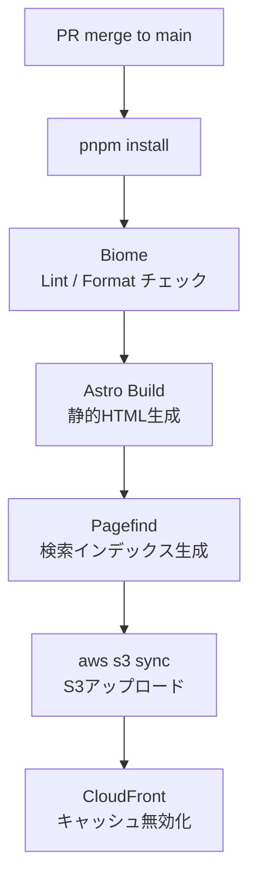
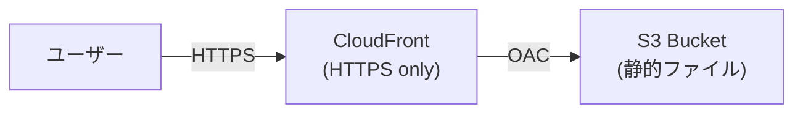

# アーキテクチャ設計

## 1. 概要

melyuh-blogはAstroによるSSG（静的サイト生成）で構築し、AWS S3 + CloudFrontで配信する。
フロントエンドからインフラまで一貫してTypeScriptとIaCで管理し、学習目的も兼ねた構成とする。

## 2. 技術スタック

| カテゴリ | 技術 | バージョン管理 |
|---|---|---|
| フレームワーク | Astro（SSGモード） | pnpm |
| 言語 | TypeScript | — |
| スタイリング | TailwindCSS v4 | pnpm |
| コンテンツ | MDX | pnpm（@astrojs/mdx） |
| 検索 | Pagefind | pnpm |
| パッケージ管理 | pnpm | mise |
| ランタイム | Node.js | mise |
| Lint / Format | Biome v2 | pnpm（devDependency） |
| pre-commit | simple-git-hooks | pnpm（devDependency） |
| 型チェック | @astrojs/check + typescript | pnpm（devDependency） |
| IaC | Terraform | グローバルインストール |
| インフラ | AWS S3 + CloudFront | — |
| CI/CD | GitHub Actions | — |

## 3. フロントエンド

### レンダリング

- **SSG（Static Site Generation）**: 全ページをビルド時に静的HTMLとして生成
- サーバーが不要なため、S3静的ホスティングと相性が良い
- Astroのデフォルトモード

### スタイリング

- **TailwindCSS**: ユーティリティファーストCSS
- ダーク/ライトモードはTailwindの `dark:` バリアントで管理
- UIテキスト（ナビゲーションラベル等）はコンポーネント内にベタ書きせず、定数ファイルに集約（将来の多言語化対応）

### 検索

- **Pagefind**: ビルド時に検索インデックスを生成するライブラリ
- サーバー不要でS3静的ホスティングに対応

## 4. 開発環境

### バージョン管理（mise）

`.mise.toml` でプロジェクトのランタイムバージョンを固定する。実際のバージョンは `.mise.toml` を参照すること。

AWS CLI・Terraformはグローバルインストール（複数プロジェクトをまたぐインフラツールのため）。

### コード品質（Biome）

- pnpm devDependencyとして管理（`package.json` にバージョン固定）
- Lint と Format を1ツールで完結
- `simple-git-hooks` と組み合わせてコミット前に自動チェック

## 5. CI/CD

### GitHub Actions

`main` ブランチへのpushをトリガーに以下を自動実行（概念図。詳細は `.github/workflows/` を参照）：

### AWS認証（OIDC）

GitHub ActionsからAWSへの認証はOIDC（OpenID Connect）を使用する。

- IAMアクセスキーをGitHub Secretsに保存しない
- GitHubがAWSに一時的なトークンを発行してもらう方式
- AWS側でGitHub ActionsのIAMロールを設定する必要がある

### リポジトリ

- **Public**: コード自体もポートフォリオとして公開

## 6. インフラ（AWS）

### 構成

概念図。詳細は `infra/` 配下のTerraformファイルを参照。

- **S3**: 静的ファイルの格納。CloudFront OAC経由のアクセスのみ許可
- **CloudFront**: HTTPSのみ許可。キャッシュ・CDN
- **Terraform**: インフラをコードで管理（IaC学習目的も兼ねる）

### Terraform

- `infra/` ディレクトリで管理
- `*.tfvars` と `*.tfstate` は `.gitignore`（機密情報のため）

## 7. 技術選定の理由

| 技術 | 選定理由 |
|---|---|
| Astro | 静的ブログに特化。ゼロJSデフォルトで高速。MDX対応 |
| TailwindCSS | 業界標準。Astroとの相性◎。CSS経験が少なくても書きやすい |
| Pagefind | 静的サイト向け検索。サーバー不要でS3対応 |
| Biome | ESLint+Prettierを1ツールで代替。高速 |
| mise | エディタ非依存の軽量バージョン管理。Zed・VS Code・Neovim問わず動作 |
| AWS S3 + CloudFront | AWSおよびIaCの理解深化のためあえて採用 |
| GitHub Actions | デプロイ自動化の経験を積む。「CI/CDを構築した」という実績になる |
